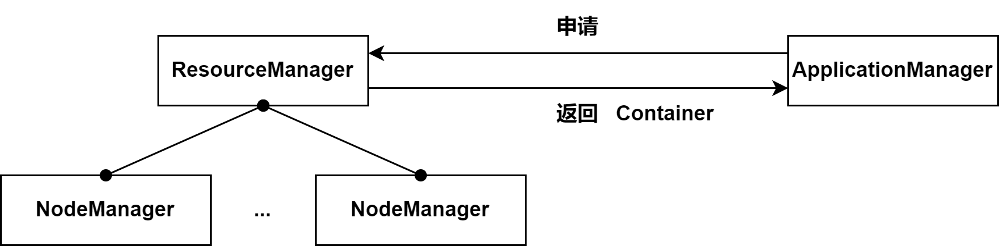
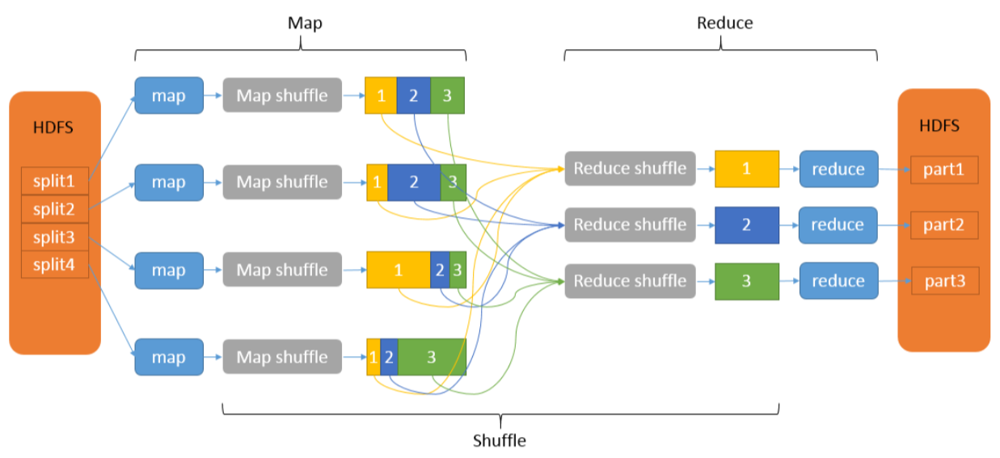

# Hadoop 大数据平台核心技术

## [⭐] 题型汇总及考核要点

一、题型

1. 单选题（15×2=30分）
2. 多选题（5×2=10分）
3. 判断题（5×2=10分）
4. 填空题（10×1=10分）
5. 简答题（2×10=20分）
6. 编程题（1×20=20分）

二、考核知识点


1. Hadoop核心组件及作用；HDFS、Map-Reduce的优缺点
2. Hadoop集群环境搭建核心配置文件的主要配置内容及关键属性
3. Hadoop集群节点名称、作用、端口号；HA高可用的原理、节点的状态转换
4. 集群环境执行MapReduce应用程序命令、HDFS常用命令、Hadoop集群启动、格式化等关键命令；
5. 机架感知副本放置策略
6. 序列化的概念、常用的序列化类，如何实现自定义序列化
7. “脑裂”现象，2种隔离机制及如何配置
8. MapReduce应用程序的执行流程、几大阶段、数据的输入输出结构及类型
9. Zoo-Keeper的作用、Zoo-Keeper集群的高可用性
10. HDFS的读数据流程、写数据流程
11. 集群搭建过程涉及到的关键命令、HDFS操作文件系统常用命令等
12. MapReduce应用程序（Mapper类、Reducer类、自定义分区类、驱动程序类的核心实现方法）
13. 重点复习相关作业；

## 考核知识点解析

### 1. Hadoop核心组件及作用；HDFS、Map-Reduce的优缺点

Hadoop框架最核心的设计是**HDFS（Hadoop Distributed File System，Hadoop分布式文件系统）**和**MapReduce（分布式计算框架）**。Hadoop 2.0及之后的版本有引入了**YARN（集群资源管理系统）**。
$$
\text{Hadoop核心组件}\begin{cases}\text{ 1. HDFS}\\\text{ 2. MapReduce}\\\text{ 3. YARN}\end{cases}
$$

- ***HDFS*** 分布式文件系统

  HDFS是Hadoop的核心组件之一，作为最底层的分布式存储服务而存在。HDFS是一个高度容错的系统，能检测和应对硬件故障，可在低成本的通用硬件上运行。HDFS采用**主/从（Master/Slaver）**架构，一般一个HDFS集群由一个`NameNode`、一个`SecondaryNameNode`和多个`DataNode`组成。

  `NameNode`是**HDFS集群的主节点**，是一个中心服务器，负责存储和管理文件系统的元数据（节点信息）。

  `SecondaryNameNode`辅助`NameNode`，分担其工作量，用于同步元数据信息。

  `DataNode`是**HDFS集群的从节点**，存储实际的数据，并汇报存储信息给`NameNode`。

  

  **HDFS的优点**

  - **高容错性：**向HDFS上传的数据会自动保存多个副本，通过增加副本的数量可以增强其容错性。如果一个副本丢失，则HDFS会启动备份策略完成新的备份。
  - **适合大数据处理：**HDFS能够处理GB、TB甚至PB级别的数据，文件数量的规模可达百万，数据量非常大。
  - **流式数据访问：**HDFS以流式数据访问存储文件，”一次写入 ，多次读取“。文件一旦写入，就不能修改，只能增加。

  **HDFS的缺点**

  - **不适合低延迟数据访问：**针对用户要求的比较短的低延迟技术，HDFS不太适合。因为HDFS是为了 处理海量数据集而设计的，为了达到高数据吞吐量，只能以牺牲低延迟为代价。
  - **无法高效存储大量小文件：**因为`NameNode`把文件系统的元数据存放于内存中，故而文件系统能容纳的文件数目就取决于`NameNode`的内存大小，如果写入的小文件太多，则`NameNode`内存会被占满，从而无法写入新文件的信息。
  - **不适合并发写入，不适合文件随机修改：**在HDFS中的文件一次只能由一个用户写入，而且写操作只能在文件末尾完成。目前还不支持多个用户同时对同一文件进行写操作，以及在文件任意位置进行修改等情况。

- ***MapReduce*** 分布式计算框架

  MapReduce是Hadoop的一个分布式计算框架，也是一种大规模数据集并行运算的编程模型，主要用于处理海量数据的运算。MapReduce主要包括`map`（映射）和`reduce`（规约）两部分。他是一个分布式运算程序的编程框架，其核心功能是将用户编写的业务逻辑代码和自带的默认组件整合成一个完整的分布式运算程序，并发运行在Hadoop集群上。

  

  **MapReduce的优点**

  - **编程简单：**程序开发者只需要简单的实现一些接口，就可以完成一个分布式应用程序，因为MapReduce通过抽象模型和计算框架把需要做什么和具体怎么做进行了拆分，为程序员提供了来了一个抽象的编程接口和框架，程序员仅需关心其应用层的具体计算问题，至于如何完成的这个并行计算相关的细节则被隐藏起来，交由计算框架去处理。
  - **可拓展性强：**当计算机资源不能得到满足的时候，可以通过简单的增加集群中的节点服务器数量来拓展它的计算能力。多项研究发现，基于MapReduce的计算能力可以随着节点数目的增长，保持近乎线性的提升，这个特点是MapReduce处理海量数据的关键，通过将计算节点增至几百甚至上千个，便可以轻松的处理数百TB，甚至PB级别的离线数据
  - **高容错性：** MapReduce设计的初衷是为了使程序能够部署在廉价的个人计算机上，这就要求它具有很高的容错性，如果集群中的一台机器宕机了，那么它就可以把上面的计算任务转移到另一个节点的机器上运行，不至于让这个任务运行失败，而且这个过程不需要人工参与，完全由Hadoop内部完成。

  **MapReduce的缺点**

  - **执行速度慢：**普通的MapReduce作业几分钟既可以完成，数据量大的可能需要几个小时，甚至一天的时间。
  - **不适合流式计算：**流式计算输入的数据要求是动态的，而MapReduce的输入数据是静态的，不能动态变化。
  - **不适合DGA（有向无环图）计算：**因为每个MapReduce作业的中间结果都需要”落地“，即需要保存到磁盘，故而会对磁盘进行大量的I/O操作，从而影响其性能。

- ***YARN*** 集群资源管理系统：其实就是管理集群的硬件资源的组件，例如分配内存和CPU。

  Hadoop YARN是开源Hadoop分布式处理框架中的**资源管理**和**作业调度**框架，它是Apache Hadoop的核心组件之一，YARN负责将**系统资源**分配给在Hadoop集群中运行的各种应用程序，并调度在不同集群节点上执行的任务。Hadoop 1.0版本中尚未引入YARN，在Hadoop 2.0版本中正式引入了YARN控件。

  YARN的组成：
  $$
  \text{YARN组件}\begin{cases}\text{ 1. ResourceManager, RM}\\\text{ 2. ApplicationMaster, AM}\\\text{ 3. NodeManager, NM}\\\text{ 4. Container}\end{cases}
  $$

  - **ResourceManager（RM）：**YARN集群的主角色，决定系统中所用应用程序之间资源分配的权限，即最终的仲裁者。
  - **NodeManager（NM）：**YARN集群的从角色，一台机器上一个，负责管理本机器上的计算资源。根据**RM**的命令，启动**Container容器**，监视容器资源使用情况，并且向主角色汇报资源的使用情况。
  - **ApplicationManager（AM）：**用户提交的每个应用程序均包含一个**AM**，它是应用程序的老大，负责<u>程序内部各阶段的资源申请</u>，监督程序的执行情况。
  - **Container：** YARN中的资源抽象，封装了某个节点上的多维度资源，如内存、CPU、磁盘、网络等。

  

  YARN的基本思想是：将资源管理和作业调度/监视功能，分解为单独的**Daemon（守护进程）**。其拥有一个全局的***RM***和每个应用程序的***AM***。应用程序可以是单个作业，也可以是作业的有向无环图。

  YARN管理资源采用的是**Master/Slave**架构，***RM***和***NM***构成了资源管理框架，在整个YARN集群中，其中一个节点运行的***RM***进程作为Master，其余节点上运行的***NM***作为Slave，***RM***负责对集群中所有资源进行统一的管理和调度，***NM***负责单个节点上资源的管理管理，它能监控一个节点上***Container***资源的使用情况，如CPU、内存、硬盘、网络等并将之报告给***RM***。

### 2. Hadoop集群环境搭建核心配置文件的主要配置内容及关键属性

Hadoop集群搭建主要有三种方式：
$$
\text{Hadoop集群搭建方式}\begin{cases}\text{ 1. 伪分布式}\\\text{ 2. 完全分布式}\\\text{ 3. 高可用方式}\end{cases}
$$

- 通用配置，修改`xxx-env.sh`，包括`Hadoop-env.sh`、`yarn-env.sh`、`mapred-env.sh`

  **添加Java环境的路径：**`export JAVA_HOME=/opt/module/jdk1.8.0_144`

- 其他配置

  - 配置`core-site.xml`

    ```xml
    <configuration>
    <!-- -->
    <!-- 指定HDFS中NameNode的地址 -->
    <![CDATA[
    <property>
    	<name>fs.defaultFS</name>
    	<value>hdfs://master:9000</value>
    </property>
    
    <!-- 指定Hadoop运行时产生文件的存储目录 -->
    <property>
    	<name>hadoop.tmp.dir</name>
    	<value>/opt/module/hadoop-2.7.7/data/tmp</value>
    </property>
    	]]>
    
    <!--指定HDFS的namenode的地址,这里与完全分布式不同，指定的是hdfs-site.xml文件中定义的namenode服务名-->
    <property> 
    	<name>fs.defaultFS</name>
    	<!--<value>hdfs://node1:9000</value>-->
        <value>hdfs://ns</value>
    </property>
    
    <!--Hadoop运行产生的临时文件保存目录-->
    <property>
    	<name>hadoop.tmp.dir</name>
    	<value>/opt/module/hadoop-2.7.7/data/tmp/</value>
    </property>
    
    <!--namenode之间的切换是通过zookeeper协调的，hdfs客户端需要访问zookeeper，就要告知zookeeper地址，告诉hdfs怎么访问zookeeper，2181是hdfs访问zookeeper的默认端口号-->
    <property>
    	<name>ha.zookeeper.quorum</name>
    	<value>master:2181,slaver01:2181,slaver02:2181</value> 
    </property>
    </configuration>
    ```

  - 配置`hdfs-site.xml`

    ```xml
    <configuration>
    <!-- 伪分布式配置 -->
    <!-- 指定HDFS副本的数量 -->
    <![CDATA[
    <property>
    	<name>dfs.replication</name>
    	<value>1</value>
    </property>
    	]]>
    
    <!-- 完全分布式配置 -->
    <!-- 指定HDFS副本的数量 -->
    <![CDATA[
    <property>
            <name>dfs.replication</name>
            <value>3</value>
    </property>
    
    <!-- 指定Hadoop辅助名称节点主机配置 -->
    <property>
             <name>dfs.namenode.secondary.http-address</name>
             <value>slaver02:50090</value>
    </property>
    	]]>
    
    <!-- 高可用配置 -->
    <!--指定hdfs的nameservices为ns，需要和core-site.xml中的保持一致-->
    <property>
    	<name>dfs.nameservices</name>
    	<value>ns</value>
    </property>
    
    <!--配置namenode的名称，配置ns中有2个namenode，分别是nn1,nn2-->
    <property>
    	<name>dfs.ha.namenodes.ns</name>
    	<value>nn1,nn2</value>
    </property>
    
    <!--配置nn1的RPC通信地址，也就是nn1的namenode的通信地址-->
    <property>
    	<name>dfs.namenode.rpc-address.ns.nn1</name>
    	<value>master:9000</value>
    </property>
    
    <!--配置nn2的RPC通信地址，也就是nn2的namenode的通信地址-->
    <property>
    	<name>dfs.namenode.rpc-address.ns.nn2</name>
    	<value>slaver01:9000</value>
    </property>
    
    <!--配置nn1的http访问地址-->
    <property>
    	<name>dfs.namenode.http-address.ns.nn1</name>
    	<value>master:50070</value>
    </property>
    
    <!--配置nn2的http访问地址-->
    <property>
    	<name>dfs.namenode.http-address.ns.nn2</name>
    	<value>slaver01:50070</value>
    </property>
    
    <!-- 配置日志文件分享和保存的位置是JournalNode，指定namenode的元数据在JournalNode上的存放位置,用于共享namenode元数据信息-->
    <property>
    	<name>dfs.namenode.shared.edits.dir</name>
    	<value>qjournal://master:8485;slaver01:8485;slaver02:8485/ns</value>
    </property>
    
    <!--指定JournalNode在本地磁盘保存数据的数据目录-->
    <property>
    	<name>dfs.journalnode.edits.dir</name>
    	<value>/opt/module/hadoop-2.7.7/data/journalnode</value>
    </property>
    
    <!--配置客户端访问服务的代理类-->
    <property>
    	<name>dfs.client.failover.proxy.provider.ns</name>
    	<value>org.apache.hadoop.hdfs.server.namenode.ha.ConfiguredFailoverProxyProvider</value>
    </property>
    
    <!--配置隔离机制，用于在故障转移期间隔离ActiveNameNode，只允许激活状态的NameNode向JournalNode上共享数据，隔离方法官网给提供2种：shell和sshfence。-->
    <property>
    	<name>dfs.ha.fencing.methods</name>
    	<value>sshfence</value>
    </property>
    
    <!--使用隔离机制时，需要SSH免密登录，所以需要将秘钥告知，实现不需要密码就可以登录-->
    <property>
    	<name>dfs.ha.fencing.ssh.private-key-files</name>
    	<value>/home/master/.ssh/id_rsa</value>
    </property>
    
    <!--开启NameNode自动故障转移,完成自动切换-->
    <property>
    	<name>dfs.ha.automatic-failover.enabled</name>
    	<value>true</value>
    </property>
    </configuration>
    ```

  - 配置`mapred-site.xml`

    ```xml
    <configuration>
    <!-- 伪分布式操作 -->
    <!-- 指定MR运行在YARN上 -->
    <![CDATA[
    <property>
    	<name>mapreduce.framework.name</name>
    	<value>yarn</value>
    </property>
    	]]>
    
    <!-- 完全分布式操作 -->
    <!-- 指定MR运行在YARN上 -->
    <![CDATA[
    <property>
            <name>mapreduce.framework.name</name>
            <value>yarn</value>
    </property>
    	]]>
    
    <!-- 高可用操作 -->
    <!-- 指定Mapreduce程序调度在yarn上，默认是local本地模式 -->
    <property>
    	<name>mapreduce.framework.name</name>
    	<value>yarn</value>
    </property>
    </configuration>
    ```

  - 配置`yarn-site.xml`

    ```xml
    <configuration>
    <!-- Site specific YARN configuration properties -->
    <!-- 伪分布式搭建方式 -->
    <![CDATA[
    <!-- Reducer获取数据的方式 -->
    <property>
     	<name>yarn.nodemanager.aux-services</name>
     	<value>mapreduce_shuffle</value>
    </property>
    
    <!-- 指定YARN的ResourceManager的地址 -->
    <property>
    	<name>yarn.resourcemanager.hostname</name>
    	<value>master</value>
    </property>
    	]]>
    
    <!-- 完全分布式搭建方式 -->
    <![CDATA[
    <!-- Reducer获取数据的方式 -->
    <property>
            <name>yarn.nodemanager.aux-services</name>
            <value>mapreduce_shuffle</value>
    </property>
    
    <!-- 指定YARN的ResourceManager的地址 -->
    <property>
            <name>yarn.resourcemanager.hostname</name>
            <value>slaver01</value>
    </property>
    	]]>
    
    <!-- 指定yarn上运行mapreduce程序 -->
    <property>
    	<name>yarn.nodemanager.aux-services</name>
    	<value>mapreduce_shuffle</value>
    </property>
    
    <!--启动ResourceManagerHA-->
    <property>
    	<name>yarn.resourcemanager.ha.enabled</name>
    	<value>true</value>
    </property>
    
    <!--配置ResourceManager的集群id，与HDFSHA中的配置namenode的服务名类似-->
    <property>
    	<name>yarn.resourcemanager.cluster-id</name>
    	<value>cluster1</value>
    </property>
    
    <!--配置ResourceManager的ID，配置为rm1和rm2-->
    <property>
    	<name>yarn.resourcemanager.ha.rm-ids</name>
    	<value>rm1,rm2</value>
    </property>
    
    <!-- 具体配置rm1是哪个节点.配置rm1的主机名 -->
    <property>
    	<name>yarn.resourcemanager.hostname.rm1</name>
    	<value>slaver02</value>
    </property>
    
    <!-- 具体配置rm2是哪个节点，配置rm2的主机名 -->
    <property>
    	<name>yarn.resourcemanager.hostname.rm2</name>
    	<value>slaver01</value>
    </property>
    
    <!-- 配置rm1的http服务地址,默认端口号8088，此处设置为18088 -->
    <property>
    	<name>yarn.resourcemanager.webapp.address.rm1</name>
    	<value>slaver02:18088</value>
    </property>
    
    <!-- 配置rm2的http服务地址，默认端口号是8088，此处设置为18088 -->
    <property>
    	<name>yarn.resourcemanager.webapp.address.rm2</name>
    	<value>slaver01:18088</value>
    </property>
    
    <!-- 由于yarn的高可靠也是通过zookeeper协调, 配置zookeeper地址 -->
    <property>
    	<name>yarn.resourcemanager.zk-address</name>
    	<value>master:2181,slaver01:2181,slaver02:2181</value>
    </property>
    </configuration>
    ```

### 3. Hadoop集群节点名称、作用、端口号；HA高可用的原理、节点的状态转换

- 集群节点

  | 节点名称          | 作用                                                         |
  | :---------------- | :----------------------------------------------------------- |
  | NameNode          | 目录的管理者，每一个集群都有一个，记录实时的数据变化。<br />如果没有NameNode，HDFS就无法工作，系统中的文件将会全部丢失，就无法将位于不同DataNode上的文件块重建文件。因此它的容错机制很有必要。 |
  | SecondaryNameNode | 用来监控HDFS状态的辅助后台程序。就像NameNode一样，每个集群都有一个SecondaryNameNode，并且部署在一个单独的服务器上。<br />SecondaryNameNode不同于NameNode，它不接受或者记录任何实时的数据变化，但是，它会与NameNode进行通信，以便定期地保存HDFS元数据的快照。由于NameNode是单点的，通过SecondaryNameNode的快照功能，可以将NameNode的宕机时间和数据损失降低到最小。<br />同时，如果NameNode发生问题，SecondaryNameNode可以及时地作为备用NameNode使用。 |
  | JournalNode       | 为了保证 Active 节点和 Standby 节点，即可以可靠的保持数据的一致性，又不会影响集群的可用性，HDFS 在 Active 节点和 Standby 节点之间引入了另外一个节点 JournalNode 节点。<br/> JournalNode 节点作为 Active 节点和 Standby 节点的中间节点，它为两个节点解决了数据的同步的问题。首先 Active 节点会将元数据发送给 JournalNode 节点，然后 Standby 节点会从 JournalNode 节点获取需要同步的元数据。即使 Standby 节点故障了、产生问题了，在它恢复正常状态后，也可以从 JournalNode 节点中同步相应的数据。这就要求 JournalNode 节点需要有持久化的功能来保证元数据不丢失。 |
  | DataNode          | 文件系统的工作节点，他们根据客户端或者是NameNode的调度存储和检索，并且定期向NameNode发送他们所存储的块的列表。<br/>集群中的每个服务器都运行一个DataNode后台程序，这个后台程序负责把HDFS数据块读写到本地的文件系统。<br />当需要通过客户端读/写某个数据时，先由NameNode告诉客户端去哪个DataNode进行具体的读/写操作，然后，客户端直接与这个DataNode服务器上的后台程序进行通信，并且对相关的数据块进行读/写操作。 |
  | ResourceManager   | （1）与客户端进行交互，处理来自于客户端的请求，如查询应用的运行情况等。<br/>（2）启动和管理各个应用的ApplicationMaster，并且为ApplicationMaster申请第一个Container用于启动和在它运行失败时将它重新启动。<br />（3）管理NodeManager，接收来自NodeManager的资源和节点健康情况汇报，并向NodeManager下达管理资源命令，例如`kill`掉某个Container。<br/>（4）资源管理和调度，接收来自ApplicationMaster的资源申请，并且为其进行分配。这个是它的最重要的职能。 |
  | NodeManager       | NM是ResourceManager在每台机器上的代理，负责容器管理，并监控它们的资源使用情况，以及向ResourceManager/Scheduler提供资源使用报告。 |

- 端口号

  | 端口号 | 作用                                       |
  | ------ | ------------------------------------------ |
  | 50070  | HDFS WEB UI 端口                           |
  | 8020   | 高可用的 HDFS RPC 端口                     |
  | 9000   | 非高可用的 HDFS RPC 端口                   |
  | 8088   | YARN 的 WEB UI 接口                        |
  | 8485   | JournalNode 的 RPC 端口                    |
  | 8019   | ZKFC 端口                                  |
  | 19888  | jobhistory WEB UI端口                      |
  | 2181   | 客户端连接 ZooKeeper 的端口                |
  | 2888   | ZooKeeper 集群内通讯使用，Leader监听此端口 |
  | 3888   | ZooKeeper 端口，用于选举leader             |

- HA 高可用的原理

  **高可用（High Availability， HA）**是指一个系统经过专门的设计，从而减少停工时间，保持其服务的高度可用性。高可用一般有两个或两个以上的节点，且分为活动节点和备用节点。通常把正在执行业务的称为活动节点，而备用节点是活动节点的一个备份节点。当活动节点出现问题，导致正在运行的业务不能正常运行时，备用节点会立即侦测到，并立即接替活动节点来执行任务，从而实现业务的不中断或短暂中断。

  对于Hadoop集群，RM和NM都是**Single Point of Failure（单点故障）**，起着**”一票否决“**的作用，所以Hadoop对NN和RM都提供了HA选项，采用的都是Active/Standby的措施来达到HA的要求。

  所谓Active/Standby就是一种热备方案，这种方案中，”在位“行使职权的Active的管理者只有一个，但有一个作为备用（即Standby）的候补管理者时刻准备着，当Active的管理者发生故障，Standby的管理者就立即顶上，并进行业务的接管，不用临时开机和初始化，所以称为”热备“，这个过程应该尽量做到让用户感觉不到。

  - HDFS的高可用

    

  - YARN的高可用

### 4. 集群环境执行MapReduce应用程序命令、HDFS常用命令、Hadoop集群启动、格式化等关键命令

- 执行MapReduce应用程序命令

  ```shell
  # xxx.jar 表示 jar 包的路径
  # xxx.class 表示类的位置
  # params 表示参数
  hadoop jar xxx.jar xxx.class params
  ```

- HDFS常用命令：和Linux命令基本没有区别

- HDFS集群启动命令

  ```shell
  # 启动 ZooKeeper
  zkServer.sh start
  
  # 启动HDFS
  start-dfs.sh
  
  # 启动YARN
  start-yarn.sh
  
  # 启动YARN的守护进程
  yarn-daemon.sh start resourcemanager
  ```

- 格式化命令

  ```shell
  hdfs namenode -format
  ```

### 5. 机架感知副本放置策略

HDFS block副本在初始放置的时候考虑到数据的安全与高效，默认会存放三份副本。由于大型集群受到机架槽位和交换机网口的限制通常会跨越多个机架，机架内部与外部的带宽往往是不一致的。因为上述的问题限制，一般，三份副本的放置策略如下所示：

- 第一个副本放置在客户端所在的节点，若客户端为远程访问则随机选择一个节点；
- 第二个副本放置在与第一个副本同机架的另外一个节点上；
- 第三个副本放置在不同机架的节点上。

如果本地的数据副本损坏，则会从同一机架的另一节点中的读取副本，机架内部的高带宽会提高读取速率，若整体机架出现问题则再从不同机架上读取副本。

HDFS 的这种副本放置策略**即为机架感知策略**，机架的整体故障率要远少于单点故障率，机架感知策略通过减少机架间的的数据传输，提高了写操作的效率。也不会影响数据的可靠性和可用性。在三副本的情况下数据块只存放在两个不同的机架上，所以此策略减少了读取数据时需要的网络传输总带宽。在这种策略下，副本并不是均匀的分布在不同的机架上：三分之一的副本在一个机架上，三分之二的副本在另外一个机架上，如果副本数大于三副本时，其它副本均匀分布在剩下的机架中，这种策略在不损害数据可靠性和读取性能的情况下改进了写的性能。

机架感知策略默认情况下是关闭的，且HDFS集群并不能自动判断节点与机架的对应关系，需要在NameNode节点上的`core-site.xml`文件中配置参数`topology.script.file.name`，该参数的value值为一个自定义脚本，脚本接收节点名或IP地址，返回值为所在机架名即可。

### 6. 序列化的概念、常用的序列化类，如何实现自定义序列化

- 序列化的概念

  Hadoop集群中各节点进程间通讯通过“RPC”来进行，而“RPC”则将消息进行序列化后再进行传输。那么我们首先要明白什么是序列化。

  **序列化（Serialization）**是指将结构化的对象转化为字节流，以便在网络上传输或者写入到硬盘进行永久存储；而**反序列化（Deserialization）**是指将字节流转回到结构化对象的过程。

  Java本身有自己的序列化机制，我们可以通过实现java.io.Serializable接口来实现，但Java本身的序列化机制过于复杂，而Hadoop的工作场景需要的序列化要快，体积要小，带宽要小。因此Hadoop实现了自己的一套更加简洁高效的序列化机制。

  为什么要序列化？

  1. 需要将内存中的对象存储到媒介中

  2. 需要将一个对象通过网络传输到另外一个系统中

  Hadoop为什么不适用JDK自带的序列化？

  JDK自带的序列化只需要类实现了`Serializable`接口，就可以通过`ObjectOutputStream`类将对象变成`byte[]`字节数组。一个对象被序列化之后会附带很多额外的信息，JDK 序列化会把对象类的描述信息和所有的属性以及继承的元数据都序列化为字节流，所以会导致生成的字节流相对比较大，这种序列化方式是JDK自带的，因此不支持跨语言。所以，JDK自带的序列化在实际项目和框架中使用较少。

- 常用的序列化类——Hadoop自带的序列化类

  | Java类型 |   Hadoop类型    |
  | :------: | :-------------: |
  | boolean  | BooleanWritable |
  |   byte   |  ByteWritable   |
  |   int    |   IntWritable   |
  |  float   |  FloatWritable  |
  |   long   |  LongWritable   |
  |  double  | DoubleWritable  |
  |  String  |      Text       |
  |   map    |   MapWritable   |
  |  array   |  ArrayWritable  |

- 实现自定义序列化

  ```java
  package com.inspur.tel;
  
  import org.apache.hadoop.io.Writable;
  
  import java.io.DataInput;
  import java.io.DataOutput;
  import java.io.IOException;
  
  /**
   * 1. 实现 org.apache.hadoop.io.Writable 接口
   * 2. 重写序列化和反序列化方法
   * 3. 编写需要的属性，并提供setter、getter方法
   * 4. 重写 toString 方法
   */
  public class TelBean implements Writable {
      private String telNo;		// 手机号
      private long upFlow;		// 上行流量
      private long downFlow;		// 下行流量
      private long totalFlow;		// 总流量
      
      // 注意: 序列化和反序列化字段的顺序要一致
      // 序列化方法
      public void write(DataOutput out) throws IOException {
          out.writeUTF(this.telNo);
          out.writeLong(this.upFlow);
          out.writeLong(this.downFlow);
          out.writeLong(this.totalFlow);
      }
      // 反序列化方法
      public void readFields(DataInput in) throws IOException {
         this.telNo = in.readUTF();
         this.upFlow = in.readLong();
         this.downFlow = in.readLong();
         this.totalFlow = in.readLong();
      }
  
      // toString方法
      @Override
      public String toString() {
          return upFlow + "\t" + downFlow + "\t" + totalFlow;
      }
  
      public String getTelNo() {
          return telNo;
      }
  
      public void setTelNo(String telNo) {
          this.telNo = telNo;
      }
  
      public long getUpFlow() {
          return upFlow;
      }
  
      public void setUpFlow(long upFlow) {
          this.upFlow = upFlow;
      }
  
      public long getDownFlow() {
          return downFlow;
      }
  
      public void setDownFlow(long downFlow) {
          this.downFlow = downFlow;
      }
  
      public long getTotalFlow() {
          return totalFlow;
      }
  
      public void setTotalFlow(long totalFlow) {
          this.totalFlow = totalFlow;
      }
  }
  ```

### 7. “脑裂”现象，2种隔离机制及如何配置

- 脑裂现象

  ZKFC有时不能准确判断当前***NN***节点是否出现问题，例如当前***NN***节点发生了`full gc`（JVM内置的一种通用垃圾回收原则，`full gc`发生时，会进行整个JVM堆空间的清理），此时节点处于假死状态，但稍后会恢复。如果此时`ZooKeeper`进行了状态切换，则会导致**两个*NN*都处于*Active*状态，这种现象叫做”脑裂”**。

  其实即使不出现问题切换过程中（主备之间的切换，其实无需等到主***NN***出现问题时再进行切换，也可以进行手动切换，方法是使用`DFSHAAdmin`命令行工具），如果**Active**的***NN***运行较慢，而**Standby**的***NN***运行较快，也会导致“脑裂”的情况发生。为了防止这种情况，HDFS提供了fence（隔离）机制，此机制提供了两种方法：`shell`和`sshfence`。

- 两种隔离机制及配置方法

  - `shell`

    当**Active NN**出现问题时，可以运行事先编写好的`shell`脚本，来执行自定义操作，如继续等待或者直接`kill`掉NameNode进程。

  - `sshfence`

### 8. MapReduce应用程序的执行流程、几大阶段、数据的输入输出结构及类型

- **MapReduce** 的概念

  Hadoop MapReduce是一个软件框架，用于轻松编写应用程序，这些应用程序以可靠、容错的方式并行处理大型硬件集群上的大量数据。**MapReduce的核心功能就是将用户编写的业务逻辑代码和自带默认组件整合成一个完整的分布式运算程序，并发运行在一个Hadoop集群上。**

  MapReduce是一种可用于数据处理的编程模型。该模型比较简单，将一个作业划分为`map`和`reduce`两个阶段:

  - `map`阶段主要是将大量的数据进行拆分，并进行并行处理（体现了分而治之的思想），此阶段处理的结果有可能是最终结果，如果不是最终结果，则再转入到`reduce`阶段；
  - `reduce`阶段的作用是将`map`的输出进行整合汇总，两个阶段互相配合，以可靠、容错的方式在集群上并行处理大量数据（TB级别的数据集）。

- **MapReduce** 应用程序的执行过程

  **MapReduce** 作业通常将输入数据集分割成独立的区块，由`map`任务以完全并行的方式处理这些区块，MapReduce框架对`map`的输出进行排序，然后将其输入到`reduce`任务中。通常作业的输入和输出都存储在文件系统中。框架负责调度任务、监视它们并重新执行失败的任务。

  作业是分成了`map`和`reduce`两种任务，源数据和计算完成的结果通常都是保存在HDFS上的。MapReduce运行流程如下图所示：

  

  - `map`阶段

    ① 系统将数据拆分为若干个“分片”（split）；原始数据在HDFS中是分块存储的，默认一个block块的大小是128M，而在MapReduce做计算时，也是将一个块看成一个片split，每个切片的大小默认是一个block块的大小。一个切片就会对应启动一个Map任务。

    ② 将分片数据以键-值方式传递给map进行处理；

    ③ map方法对数据进行业务处理；

    ④ 将处理的数据写入到磁盘。

  - `reduce`阶段

    ① 通过多个复制线程去拉取不同`map`节点输出的数据文件；

    ② 对这些数据文件进行排序和合并，然后传入`reduce`方法；

    ③ `reduce`方法对数据进行业务处理；

    ④ 输入数据到文件系统（HDFS）。

- 数据的输入输出结构及类型

  

### 9. Zoo-Keeper的作用、Zoo-Keeper集群的高可用性

**ZooKeeper**是Apache软件基金会的一个软件项目，由`Java`语言编写。它一个能够**高效开发**和**维护分布式**的开放源代码的**应用协调服务**，是Hadoop和HBase的重要组件。它主要是用来**解决分布式应用中经常遇到的一些数据管理问题**，如：统一命名服务、状态同步服务、集群管理、分布式应用配置项的管理等。

**ZooKeeper**本身也是一个分布式系统，它主要有以下三个特点：

1. 具有存储功能，但通常用它来保存应用系统的元数据信息，在Hadoop的HA集群中，使用ZooKeeper的存储功能来保存NameNode的状态信息；
2. 对数据的变化提供监听和触发事件机制；Hadoop HA集群中，ZooKeeper会监听两个NameNode的工作状态，当状态发生改变时，由其协调Active与Standby状态的切换；
3. 具有强大的高可用性，ZooKeeper集群的节点只要有半数以上存活，就可以对外提供服务。

### 10. HDFS的读数据流程、写数据流程


### 11. 集群搭建过程涉及到的关键命令、HDFS操作文件系统常用命令等


### 12. MapReduce应用程序（Mapper类、Reducer类、自定义分区类、驱动程序类的核心实现方法）

请务必先看这个视频：[MapReduce工作流程](https://www.bilibili.com/video/BV1TB4y1i7kk/?spm_id_from=333.337.search-card.all.click&vd_source=e2e36b51d8fc4b2ce748fba0d254595a)

以**NBA统计冠军数项目**为例：

- `Mapper`类

  ```java
  package com.self.nba_champion.ChampionCounter;
  /**
   * @author       : NilEra
   * @date         : 2023/11/30 10:39
   * description   : None
   */
  
  import org.apache.hadoop.io.IntWritable;
  import org.apache.hadoop.io.LongWritable;
  import org.apache.hadoop.io.Text;
  import org.apache.hadoop.mapreduce.Mapper;
  
  import java.io.IOException;
  
  public class ChampionMapper extends Mapper<LongWritable, Text, Text, IntWritable> {
      Text newKey = new Text();
      IntWritable newValue = new IntWritable(1);
      protected void map(LongWritable key, Text value, Mapper<LongWritable, Text, Text, IntWritable>.Context context) throws IOException, InterruptedException {
          String[] split = value.toString().split(",");
          String champion = split[2];
          //获取分区标识
          String area=null;
          if (split.length == 7)
              area = split[6];
          if (area != null)
              newKey.set(champion + "," + area);
          else
              newKey.set(champion);
          context.write(newKey, newValue);
      }
  }
  ```

- `Reducer`类

  ```java
  package com.self.nba_champion.ChampionCounter;
  /**
   * @author       : NilEra
   * @date         : 2023/11/30 10:39
   * description   : None
   */
  
  import org.apache.hadoop.io.IntWritable;
  import org.apache.hadoop.io.Text;
  import org.apache.hadoop.mapreduce.Reducer;
  
  import java.io.IOException;
  
  public class ChampionReducer extends Reducer<Text, IntWritable, Text, IntWritable> {
      IntWritable iw = new IntWritable();
      protected void reduce(Text key, Iterable<IntWritable> value, Reducer<Text, IntWritable, Text, IntWritable>.Context context) throws IOException, InterruptedException {
          int sum = 0;//统计每支冠军球队数量
          for (IntWritable iw : value) {
              sum += iw.get();
          }
          iw.set(sum);
          context.write(key, iw);
      }
  }
  ```

- 自定义分区类

  ```java
  package com.self.nba_champion.ChampionCounter;
  /**
   * @author       : NilEra
   * @date         : 2023/11/30 10:39
   * description   : None
   */
  
  import org.apache.hadoop.io.IntWritable;
  import org.apache.hadoop.io.Text;
  import org.apache.hadoop.mapreduce.Partitioner;
  
  public class ChampionPartitioner extends Partitioner<Text, IntWritable> {
      public int getPartition(Text key,IntWritable value,int numPartitions){
          String[] split = key.toString().split(",");
          String area = null;
          if (split.length>1){ area=split[1]; }
          if ("E".equals(area)){ return 0; }
          else if ("W".equals(area)){ return 1; }
          else { return 2; }
      }
  }
  ```

- 驱动程序类

  ```java
  package com.self.nba_champion.ChampionCounter;
  /**
   * @author       : NilEra
   * @date         : 2023/11/30 10:39
   * description   : None
   */
  
  import org.apache.hadoop.conf.Configuration;
  import org.apache.hadoop.fs.Path;
  import org.apache.hadoop.io.IntWritable;
  import org.apache.hadoop.io.Text;
  import org.apache.hadoop.mapreduce.Job;
  import org.apache.hadoop.mapreduce.lib.input.FileInputFormat;
  import org.apache.hadoop.mapreduce.lib.output.FileOutputFormat;
  
  public class ChampionMain {
      public static void main(String[] args) throws Exception {
          Configuration conf = new Configuration();
          Job job = Job.getInstance(conf);
  
          job.setJarByClass(ChampionMain.class);
          job.setMapperClass(ChampionMapper.class);
          job.setReducerClass(ChampionReducer.class);
          
          job.setMapOutputKeyClass(Text.class);
          job.setMapOutputValueClass(IntWritable.class);
          
          job.setOutputKeyClass(Text.class);
          job.setOutputValueClass(IntWritable.class);
          
          job.setCombinerClass(ChampionReducer.class);
          job.setPartitionerClass(ChampionPartitioner.class);
          
          job.setNumReduceTasks(3);
          FileInputFormat.setInputPaths(job,new Path(args[0]));
          FileOutputFormat.setOutputPath(job,new Path(args[1]));
          System.out.println(job.waitForCompletion(true));
      }
  }
  ```

  


